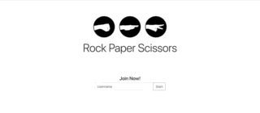

# RPS-Multiplayer

An online mutiplayer Rock Paper Scissors game, where two players can play the game in real-time. Also if the game is full you can observe the current game and join once a player leaves or disconnects.

Also available is a chat box where players and guests can send messages to eachother, also a chatbot logs whenever a player/guest joins and leaves. 

## Getting Started
Go to [github.com/aewagner/RPS-Multiplayer](https://github.com/aewagner/RPS-Multiplayer) to access my repository. 

Also check out the live version of the game here [aewagner.github.io/RPS-Multiplayer](https://aewagner.github.io/RPS-Multiplayer).

## Built With
+ HTML
+ CSS
+ Bootsrap 4
+ Javascript
+ jQuery
+ Firebase

## Acknowledgements
+ [Bootstrap](https://getbootstrap.com/)
